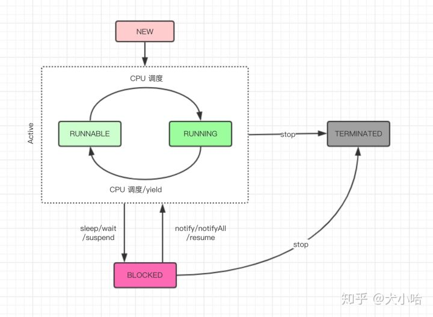
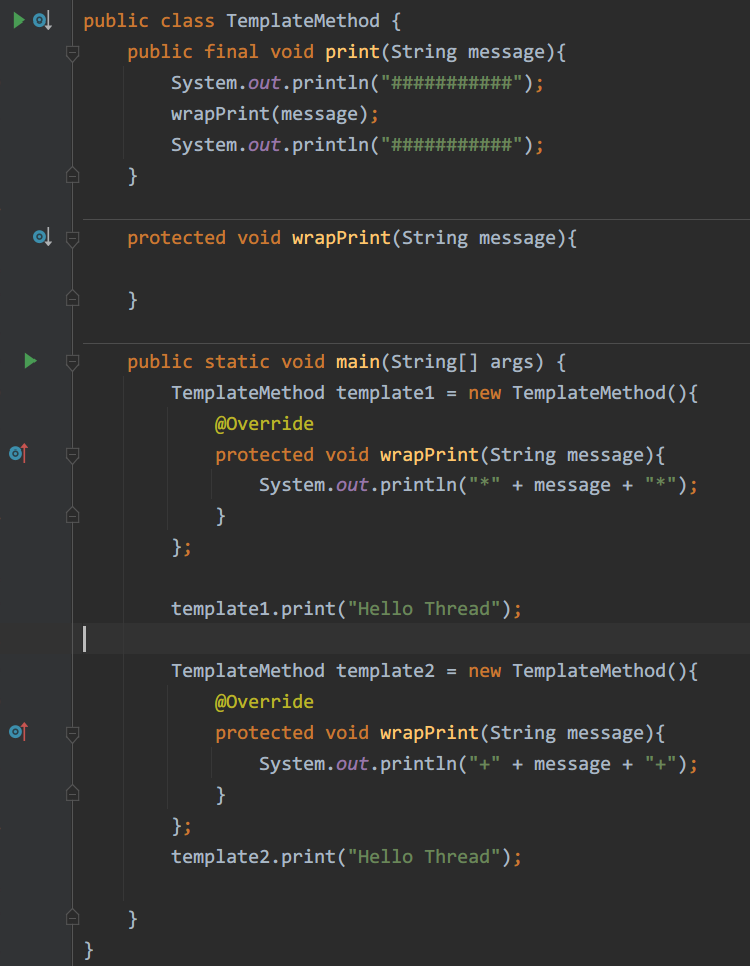
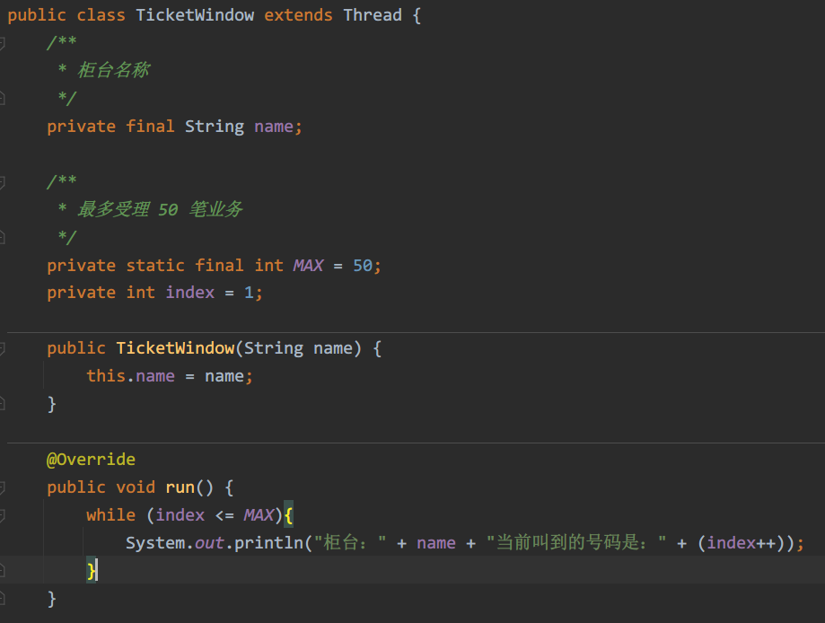
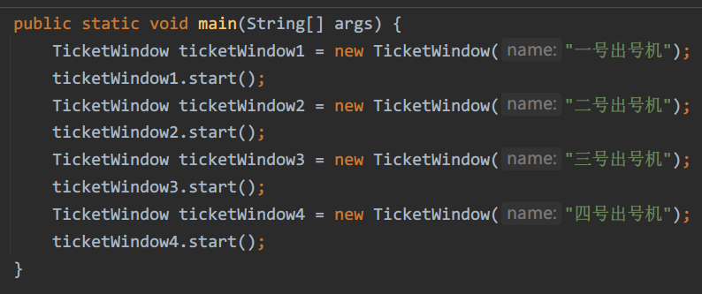
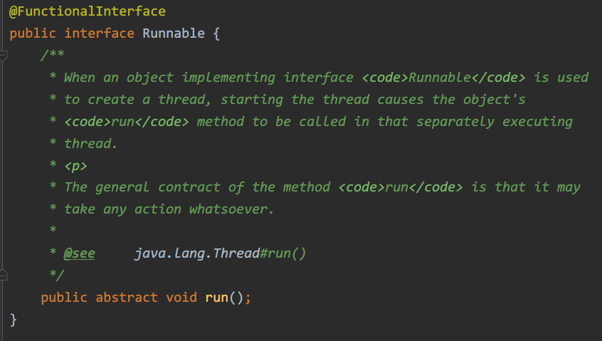
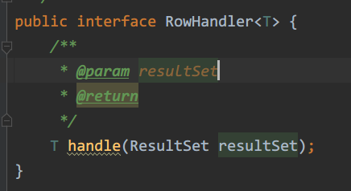
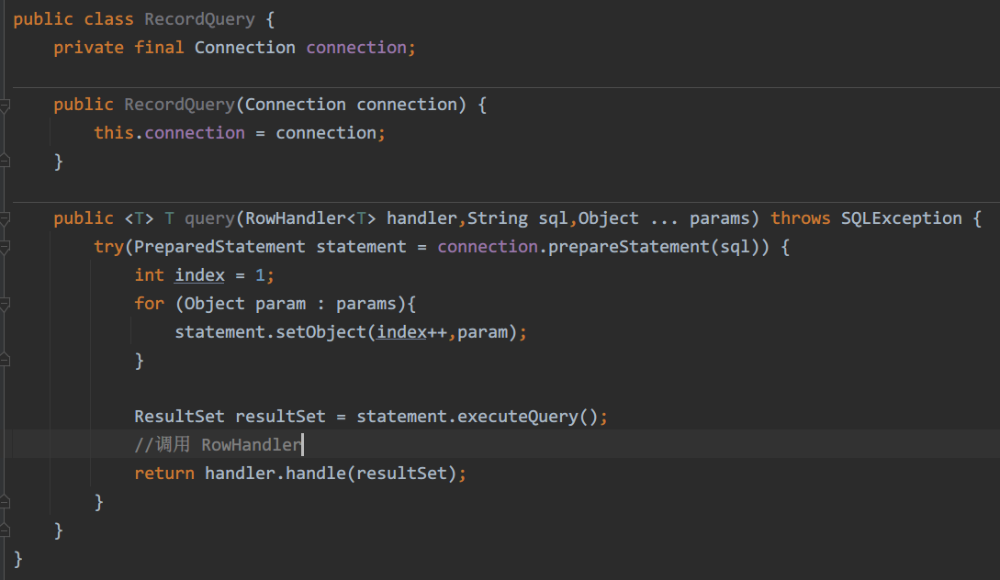
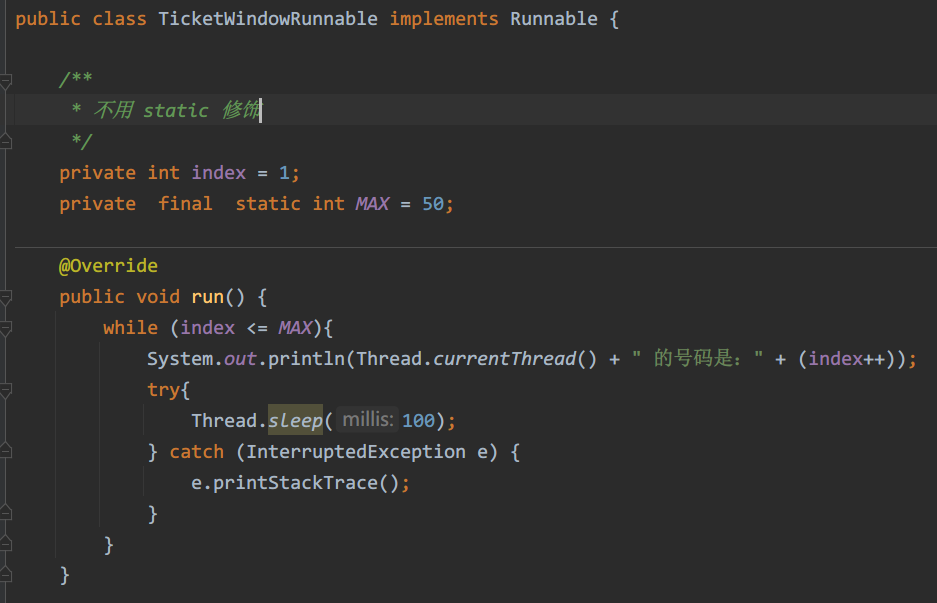
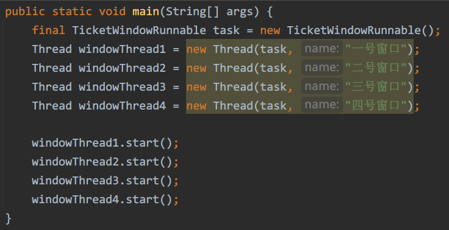

# 第一章 快速认识线程
在计算机的世界里，当我们讨论并行的时候，实际上是指，一系列的任务在计算机中同时运行，比如在浏览网页的时候还能打开音乐播放器，在撰写邮件的时候，收件箱还能接收新邮件。**在单CPU的计算机中，其实没有真正的并行，它只不过是CPU时间钟快速轮转调度带给你的错觉**，而这种错觉让你产生了它们真的在同一时刻同时运行。当然**如果是多核CPU，那么并行运行还是真实存在的**。
## 线程的生命周期

- 线程的生命周期大体可以分为如下5个主要的阶段
	- NEW
	- RUNNABLE
	- RUNNING
	- BLOCKED
	- TERMINATED

### 线程的 NEW 状态
当我们用关键字 new 创建一个 Thread 对象时，此时它并不处于执行状态，因为没有调用 start 方法启动该线程，那么线程的状态为 NEW 状态，**准确的说，它只是 Thread 对象的状态，因为在没有 start 之前，该线程根本不存在，与你用关键字 new 创建一个普通的 Java 对象没什么区别**
**NEW 状态通过 start 方法进入 RUNNABLE 状态**
### 线程的 RUNNABLE 状态
线程对象进入 RUNNABLE 状态必须调用 start 方法，此时才是**真正的在 JVM 进程中创建了一个线程**，线程一经启动就可以立即得到执行吗？答案是否定的，线程的运行与否和进程一样要听 CPU 的调度，我们把这个中间状态称为**可执行状态（RUNNABLE），也就是它具备执行的资格，但是并没有真正地执行起来而是在等待 CPU 的调度**
**由于存在 RUNNING 状态，所以不会直接进入 BLOCKED 状态和 TERMINATED 状态，即使是在线程的执行逻辑中调用 wait、sleep 或者其他 block 的 IO 操作等，也必须先获得 CPU 的调度权才可以，严格来将，RUNNABLE 的线程只能意外终止或者进入 RUNNING 状态**
（zpl：RUNNABLE 状态下的线程并没有在执行，线程中的各种操作只能在线程执行的时候生效）
### 线程的 RUNNING 状态
一旦 CPU 通过轮询或者其他方式从任务可执行队列中选中了线程，那么此时它才能真正地执行自己的逻辑代码，需要说明的一点是**一个正在 RUNNING 状态的线程事实上也是 RUNNABLE 的，但反过来则不成立**
在该状态下，线程的状态可以发生如下的状态转换
- 直接进入 TERMINATED 状态，比如调用了 JDK 已经不推荐使用的 stop 方法或者判断某个逻辑标识
- 进入 BLOCKED 状态，比如调用了 sleep，或者 wait 方法而加入了 waitSet 中
- 进行某个阻塞的 IO 操作，比如因网络数据的读写而进入了 BLOCKED 状态
- 获取某个锁资源，从而加入到该锁的阻塞队列中而进入了 BLOCKED 状态
- 由于 CPU 的调度器轮询使该线程放弃执行，进入 RUNNABLE 状态
- 线程主动调用 yield 方法，放弃了 CPU 执行权，进入 RUNNABLE 状态
### 线程的 BLOCKED 状态
线程在 BLOCKED 状态可以切换至如下几个状态
- 直接进入 TERMINATED 状态，比如调用 JDK 已经不推荐使用的 stop 方法或者意外死亡（JVM Crash）（zpl：）
- 线程阻塞的操作结束，比如读取了想要的数据字节进入到 RUNNABLE 状态
- 线程完成了指定时间的休眠，进入到了 RUNNABLE 状态
- wait 中的线程被其他线程 notify / notifyall 唤醒，进入 RUNNABLE 状态
- 线程获取到了某个锁资源，进入 RUNNABLE 状态
- 线程在阻塞过程中被打断，比如**其他线程调用了 interrupt 方法，进入 RUNNABLE 状态**
### 线程的 TERMINATED 状态
TERMINATED 是一个线程的最终状态，**在该状态中线程将不会切换到其他任何状态**，线程进入 TERMINATED 状态，意味着该线程的整个生命周期都结束了，下列这些情况将会使线程进入 TERMINATED 状态
- 线程运行正常结束，结束生命周期（zpl：这不就是从 RUNNING 变成 TERMINATED？）
- 线程运行出错意外结束
- JVM Crash（zpl：又是你），导致所有的线程都结束
## 线程的 start 方法剖析：模版设计模式在 Thread 中的应用

### Thread start 方法源码分析以及注意事项
Thread start 方法的源码
```java
public synchronized void start() {
        if (this.threadStatus != 0) {
            throw new IllegalThreadStateException();
        } else {
            this.group.add(this);
            boolean started = false;

            try {
                this.start0();
                started = true;
            } finally {
                try {
                    if (!started ) {
                        this.group.threadStartFailed(this);
                    }
                } catch (Throwable ignore) {
                }
            }
        }
    }
```
其中最核心的部分是 start0 这个本地方法，也就是 JNI 方法：
`private native void start0();`
也就是说在 start 方法中会调用 start0 方法，那么重写的那个 run 方法何时被调用了呢？
在 JDK 的官方文档中，在 start 方法中有如下的注释说明：
> Causes this thread to begin execution; the Java Virtual Machine calls the `run` method of this thread

也就是说线程开始执行后，JVM 会调用线程的 run 方法，换句话说，**run 方法是被 JNI 方法 start0() 调用的**

从 start 方法的源码中可以总结出如下几点
- Thread 被构造后的 NEW 状态，事实上 threadStatus 这个内部属性为0（zpl：可以从 if 的判断条件得出）
- 不能两次启动 Thread，否则就会出现 IllegalThreadStateException 异常（zpl：if 的判断和紧接着的代码）
- 线程启动后将会被加入到一个 ThreadGroup 中（zpl：`this.group.add(this);`）
- 一个线程生命周期结束，也就是到了 TERMINATED 状态，再次调用 start 方法是不允许的，也就是说 TERMINATED 状态是没有办法回到 RUNNABLE / RUNNING 状态的

### 模版设计模式在 Thread 中的应用
从上面我们可以看出，**线程真正的执行逻辑实在 run 方法中，通常我们会把 run 方法称为线程的执行单元**，这也就回答了我们最开始提出的疑问（zpl：这个疑问是书中前面写到的，为什么重写的是 Thread 的 run 方法，但调用的确是 run 方法），重写 run 方法，用 start 方法启动线程。Thread 中 run 方法的代码如下，如果我们没有使用 Runnable 接口对其进行改造，则可以认为 Thread 的 run 方法本身就是一个空的实现：
```java
@Override
public void run(){
	if (target != null){
		target.run();
	}
}
```
其实 Thread 的 run 和 start 就是一个比较典型的模版设计模式，**父类编写算法结构代码，子类实现逻辑细节**（zpl：这个还是比较好理解的，父类把算法结构也就是流程写好，然后到具体的逻辑部分使用子类多态来执行），下面通过一个简单的例子来看一下模版设计模式（zpl：代码太长我直接贴图了）



print 方法类似于 Thread 的 start 方法，而 wrapPrint 则类似于 run 方法，这样做的好处是，**程序结构由父类控制，并且是 final 修饰的，不允许被重写，子类只需要实现想要的逻辑任务即可**（zpl：讲的还是很好理解的）
### Thread 模拟营业大厅叫号机程序
假设大厅共有四台出号机，这就意味着有四个线程在工作，下面我们用程序模拟一下叫号的过程，约定当天最多受理50笔业务，也就是说号码最多可以出到50
代码截图如下


写一个 main 函数，定义四个 TicketWindow 线程并启动，代码截图如下

这样输出的结果是每个叫号机都会输出从 1 到 50
之所以会这样，是因为每个线程的逻辑执行单元都不一样（zpl：后续的话有些啰嗦了，我就概括一下，得出结论是 index 不唯一，四个线程就有四个 index，要使 index 唯一，最简单的办法就是把 index 变成类变量）
通过对 index 进行 static 修饰，做到了多线程下共享资源的唯一性，看起来似乎满足了我们的需求（事实上，如果将最大号码调整到 500、1000 等稍大一些的数字就会出现线程安全问题（zpl：问题出在 index++ 这部分代码，自增这个操作不是一个原子性操作，当两个线程同时对同一个 index 进行自增并赋值时，等于会出两张同号的票，这里并发少可能体现不出问题，量上去了之后问题就会暴露出来）），但是只有一个 index 共享资源，如果共享资源很多呢？共享资源要经过一些比较复杂的计算呢？不可能都使用 static 修饰，而且 static 修饰的变量生命周期很长（zpl：静态变量的生命周期和类相同，类被卸载才会销毁静态变量），所以 Java 提供了一个接口 Runnable 专门用于解决该问题，将线程的控制和业务逻辑的运行彻底分离开来
## Runnable 接口的引入以及策略模式在 Thread 中的使用
### Runnable 的职责
Runnable 接口非常简单，只定义了一个无参数无返回值的 run 方法，具体代码如下：



很多软文以及一些书籍中，经常会提到，创建线程有两种方式，第一种是构造一个 Thread，第二种是实现 Runnable 接口，这种说法是错误的，最起码是不严谨的，在 JDK 中代表线程的就只有 Thread 这个类，我们在前面分析过，线程的执行单元就是 run 方法，你可以通过继承 Thread 然后重写 run 方法实现自己的业务逻辑，也可以实现 Runnable 接口实现自己的业务逻辑，代码如下：

```java
Override
public void run(){
//如果构造 Thread 时传递了 Runnable，则会执行 Runnable 的 run 方法
	if (target != null){
		target.run();
	}
//否则需要重写 Thread 类的 run 方法
}
```
上面代码段是 Thread run 方法的源码，我在其中加了两行注释更加清晰地说明了实现执行单元的两种方式，所以说的创建线程有两种方式，一种是创建一个 Thread，一种是实现 Runnable 接口，这种说法是不严谨的。准确的讲，创建线程只有一种方式那就是构造 Thread 类，而实现线程的执行单元则有两种方式，第一种是重写 Thread 的 run 方法，第二种是实现 Runnable 接口的 run 方法，并且将 Runnable 实例用作构造 Thread 的参数

### 策略模式在 Thread 中的应用
无论是 Runnable 的 run 方法，还是 Thread 类本身的 run 方法（事实上 Thread 类也是实现了 Runnable 接口）都是想将线程的控制本身和业务逻辑的运行分离开来，达到职责分明、功能单一的原则，这一点与 GoF 设计模式中的策略设计模式很相似，下面先看一下策略模式，再来对比 Thread 和 Runnable 两者之间的关系
下面是一个简单的 JDBC 查询操作，把数据的封装部分抽成一个策略接口



RowHandler 接口只负责对从数据库中查询出来的结果集进行操作，至于最终返回成什么样的数据结构，需要你自己去实现，类似于 Runnable 接口（zpl：Runnable 接口只不过是自己写线程需要执行的业务逻辑）



RecordQuery 中的 query 只负责将数据查询出来，然后调用 RowHandler 进行数据封装，这样做有什么好处？
好处就是可以用 query 方法应对任何数据库的查询，返回结果的不同只会因为你传入的 RowHandler 的不同而不同，同样 RecordQuery 只负责数据的获取，而 RowHandler 只负责数据的加工，职责分明，每个类均功能单一，通过这个例子就可以看出 Thread 和 Runnable 之间的关系了

重写 Thread 类的 run 方法和实现 Runnable 接口的 run 方法还有一个很重要的不同，那就是 Thread 类的 run 方法是不能共享的，也就是说 A 线程不能把 B 线程的 run 方法当作自己的执行单元，而使用 Runnable 接口则很容易就能实现这一点，使用同一个 Runnable 实例构造不同的 Thread 实例
### 模拟营业大厅叫号机程序
用 Runnable 接口重构一下前面的叫号机程序


