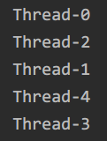
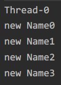

# 第二章 深入理解 Thread 构造函数
## 线程的命名
### 线程的默认命名
下面几个构造函数中，并没有提供为线程命名的参数，那么线程会怎样命名呢？
- `Thread()`
- `Thread(Runnable target)`
- `Thread(ThreadGroup group,Runnable target)`

打开 JDK 的源码会看到下面的代码

```
public Thread(Runnable target) {
        init(null, target, "Thread-" + nextThreadNum(), 0);
    }

/* For autonumbering anonymous threads. */
private static int threadInitNumber;
private static synchronized int nextThreadNum() {
    return threadInitNumber++;
}
```

如果没有为线程显式的指定一个名字，那么线程将会以 “Thread-” 作为前缀与一个自增数字进行组合，这个自增数字在整个 JVM 进程中将会不断自增（zpl：这是起了5个线程，但是写法应该是 Java 8 的写法，能看出来的有 lambda 表达式还有这个 Stream，这个 Stream 的用法太复杂了）：

```
public class AnonymousThread {
    public static void main(String[] args) {
        IntStream.range(0, 5).boxed().map(i -> new Thread(
                () -> System.out.println(Thread.currentThread().getName())
        )).forEach(Thread::start);
    }
}
```

执行上面代码得到输出，输出结果和源码分析出来的是一样的：



### 线程命名
Thread 也提供了指定名称的构造方法，建议在构造线程的时候为线程赋予一个特殊的名字
- `Thread(Runnable target,String name)`
- `Thread(String name)`
- `Thread(ThreadGroup group,Runnable target,String name)`
- `Thread(ThreadGroup group,Runnable target,String name,long starckSize)`
- `Thread(ThreadGroup group,String name)`

```
public class ThreadConstruction {
    private final static String PREFIX = "ALEX-";

    public static void main(String[] args) {
        IntStream.range(0, 5).mapToObj(ThreadConstruction::createThread).forEach(Thread::start);
    }

    private static Thread createThread(final int intName) {
        return new Thread(
                () -> System.out.println(Thread.currentThread().getName()), PREFIX + intName
        );
    }
}
```
（zpl：这个创建线程对象的方法更离谱了）输出如下


### 修改线程的名字
不论你使用的是默认的函数命名规则，还是指定了一个特殊的名字，**在线程启动之前还有一个机会可以对其进行修改，一旦启动，名称将不再被修改**，下面是 Thread 的 setName 源码：
```
public final synchronized void setName(String name) {
        checkAccess();
        this.name = name.toCharArray();
        if (threadStatus != 0) {
            setNativeName(name);
        }
    }
```


zpl：这里应该是书中写的有问题，这个判断 threadStatus != 0 的意思是当线程不是 NEW 状态时，修改线程的名称
以下是我个人的测试代码
```
public class ChangeThreadName {
    public static void main(String[] args) throws InterruptedException {
        Thread thread = new Thread(new Runnable() {
            @Override
            public void run() {
                try {
                    while (true) {
                        System.out.println(Thread.currentThread().getName());
                        TimeUnit.SECONDS.sleep(1);
                    }
                } catch (InterruptedException e) {
                    e.printStackTrace();
                }
            }
        });

        thread.start();
        int i = 0;
        while (true) {
            TimeUnit.SECONDS.sleep(1);
            thread.setName("new Name" + i);
            i++;
        }

    }
}
```
就是让 main 线程一直去 setName，然后线程一直输出自己的 name



这里可以明显看出线程名已经改变了

线程在没调用 start 前 setName 也生效了，那么这个threadStatus != 0 判断的意义到底是什么？

## 线程的父子关系
Thread 的所有构造函数，最终都会去调用一个静态方法 init，代码片段如下
```java
private void init(ThreadGroup g, Runnable target, String name,
                      long stackSize, AccessControlContext acc) {
        if (name == null) {
            throw new NullPointerException("name cannot be null");
        }
        this.name = name.toCharArray();
        Thread parent = currentThread();  //获取当前线程作为父线程
        SecurityManager security = System.getSecurityManager();
```

上面代码中的 `currentThread()` 是获取当前线程，在线程声明周期中，我们说过线程的最初状态为 NEW，没有执行 start 方法前，它只能算是一个 Thread 的实例，并不意味着一个新的线程被创建，因此 `currentThread()` 代表的将会是创建它的那个线程，因此我们可以得出以下结论：
- 一个线程的创建肯定是由另一个线程完成的
- 被创建线程的父线程是创建它的线程

## Thread 与 ThreadGroup
在 Thread 的构造函数中，可以显式的指定线程的 Group，也就是 ThreadGroup
接着往下阅读 Thread init 方法的源码：
```
if (g == null) {
            /* Determine if it's an applet or not */
            /* If there is a security manager, ask the security manager
               what to do. */
            if (security != null) {
                g = security.getThreadGroup();
            }
            /* If the security doesn't have a strong opinion of the matter
               use the parent thread group. */
            if (g == null) {
                g = parent.getThreadGroup();
            }
        }
```

通过对源码的分析，我们可以看出，如果在构造 Thread 的时候没有显示地指定一个 ThreadGroup，那么子线程将会被加入到父线程所在的线程组

## 守护线程
守护线程是一类比较特殊的线程，一般用于处理一些后台的工作，比如 JDK 的垃圾回收线程
什么是守护线程？为什么要有守护线程，以及何时需要守护线程？
我们必须先搞清另外一个特别重要的问题：JVM 程序在什么情况下会退出？
> The Java Virtual Machine exits when the only threads running are all daemon threads.

> （zpl：Java 虚拟机在只剩守护线程运行时退出）

上面这句话来自与 JDK 的官方文档，通过这句话的描述，我们不难发现，在正常情况下，若 JVM 中没有一个非守护线程，则 JVM 退出
### 什么是守护线程
我们先通过一个简单的程序来认识一下守护线程和守护线程的特点：
```
public class DaemonThread {
    public static void main(String[] args) throws InterruptedException {
        Thread thread = new Thread(() -> {
            while (true) {
                try {
                    Thread.sleep(1);
                } catch (InterruptedException e) {
                    e.printStackTrace();
                }
            }
        });
        // thread.setDaemon(true);
        thread.start();
        Thread.sleep(2_000L);
        System.out.println("Main thread finished lifecycle");
    }
}
```

上面代码中存在两个线程，一个是由 JVM 启动的 main 线程，另一个则是我们自己创建的线程 thread，你会发现 JVM 进程永远都不会退出，即使 main 线程正常的结束了自己的生命周期，原因就是因为在 JVM 进程中还存在一个非守护线程在运行
如果打开注释 `thread.setDaemon(true);`，也就是将线程设置为守护线程，那么 main 进程结束生命周期后，JVM 也会随之退出运行，当然 thread 线程也会结束

线程是否为守护线程和它的父线程有很大关系，如果父线程是正常线程，则子线程也是正常线程，反之亦然，如果你想要修改它的特性则可以借助 `setDaemon` 方法。`isDaemon` 方法可以判断该线程是不是守护线程

另外要注意的是，`setDaemon` 方法只在线程启动之前才能生效，如果一个线程已经死亡，那么再设置 `setDaemon` 则会抛出 `IllegalThreadStateException` 异常

### 守护线程的作用
通过上面的分析，如果一个 JVM 进程中没有一个非守护线程，那么 JVM 会退出，也就是说**守护线程具备自动结束生命周期的特性，而非守护线程则不具备这个特点**

试想一下如果 JVM 进程的垃圾回收线程是非守护线程，如果 main 线程完成了工作，则 JVM 无法退出，因为垃圾回收线程还在正常的工作。
再比如有一个简单的游戏程序，其中有一个线程正与服务器不断地交互以获取玩家最新的金币、武器信息，若希望在退出游戏客户端的时候，这些数据同步的工作也能够立即结束等等

守护线程经常用作与执行一些后台任务，因此有时它被称为后台线程，当你希望关闭某些线程的时候，或者退出 JVM 进程的时候，一些线程能够自动关闭，此时就可以考虑用守护线程为你完成这样的工作